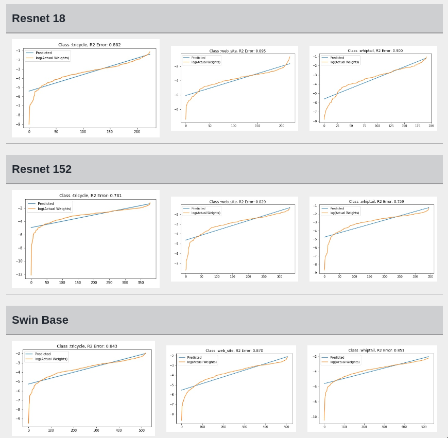
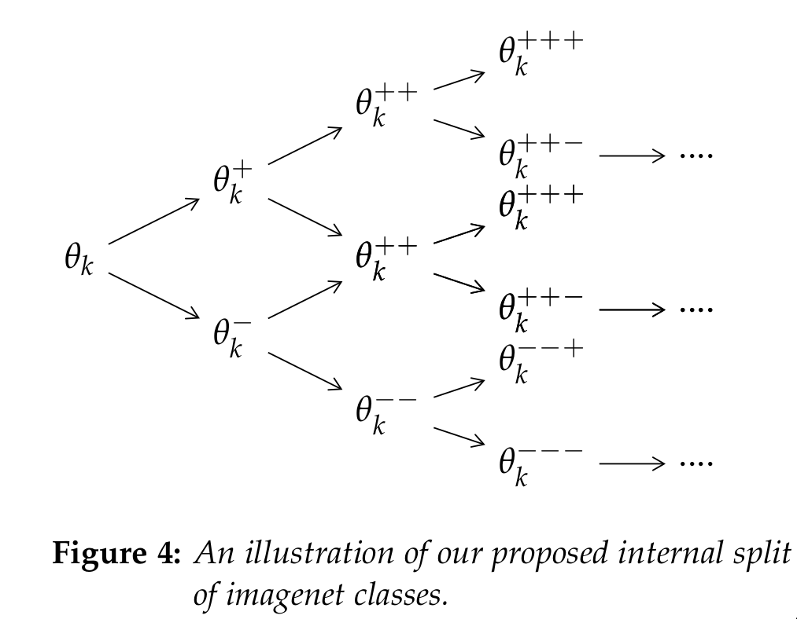

TL;DR:
I have written a more formal summary of my findings in [this document](https://arxiv.org/pdf/2205.11908.pdf). The results of fitting ALD to FC weights are [here](https://drive.google.com/file/d/1ce90RTQKhYIoxhJrqvhxw6VdjLMEGHkm/view?usp=sharing) and visualization of the most discriminative neurons using Smooth GramCam++ is [here](https://drive.google.com/drive/folders/1aWOlXt20iZJGgaXFMusCTYmJkOyLImLj?usp=sharing).
You can also replicate my experiment results by running the **notebooks** in this repo or by running this [Kaggle Notebook](https://www.kaggle.com/code/meaninglesslives/fit-ald/) for fitting ALD and [this](https://www.kaggle.com/meaninglesslives/visualize-internal-split/) for visualizing the internal split. 

Like everyone else, I have struggled to interpret the predictions generated from neural networks. Sometimes networks fail on the most trivial of tasks and sometimes they succeed on the hardest. I have encountered similar difficulty while working with images, pointcloud data, text and even audio data. The interpretability of neural network predictions remains difficult regardless of the model architecture and input modality.

Recently while reading about policy gradient methods in reinforcement learning, I thought of a possible connection between the current supervised learning paradigm and offline policy gradient RL. This observation allowed me to make a prediction regarding the distribution of weights in the final fully connected layer. I didn't have high hopes but when I looked deeper, I observed that the weights of pre-trained ImageNet models indeed seem to closely follow a particular distribution, namely [Asymmetric Laplace Distribution](https://en.wikipedia.org/wiki/Asymmetric_Laplace_distribution).

### Proposed recursive split of classes internally
While fitting ALD distributions to the FC layer weights for each class $\theta_k$, I observed a recursive pattern in the isolated weights. Let $\theta_k^+$ denote the weights for the positive sub-class [i.e. the possibility that the sample belong to class k] \& $\theta_k^-$ denote the weights for the negative class [i.e. the possibility that the sample is outside training set]. I hypothesize that $\theta_k^+$ and $\theta_k^-$ can be further sub-divided and fitted with ALD. I hypothesize that the network recursively builds a tree like internal representation for each class.

**This was just a brief summary of the idea. Please refer to the formal summary or blog post for more details.**
